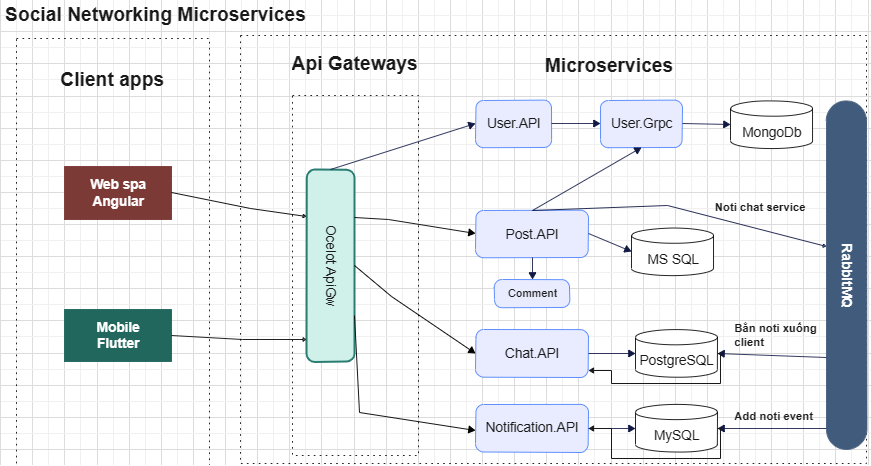
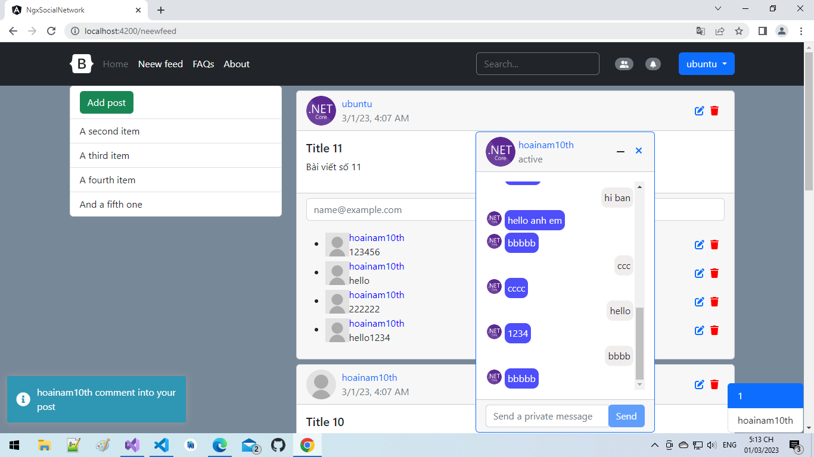
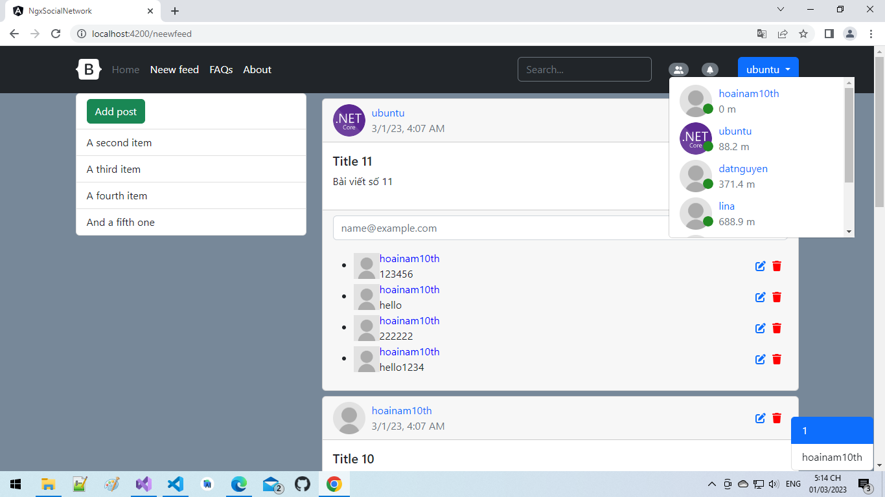
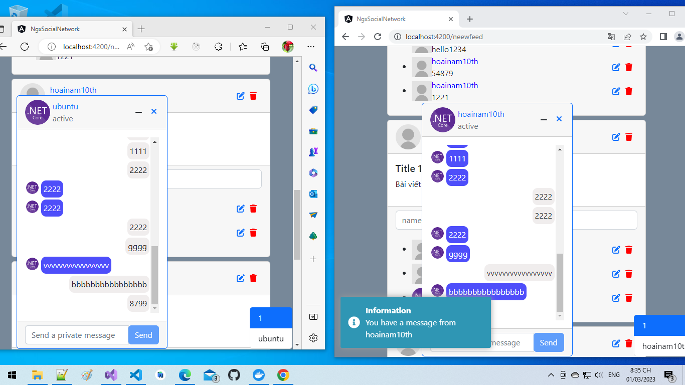
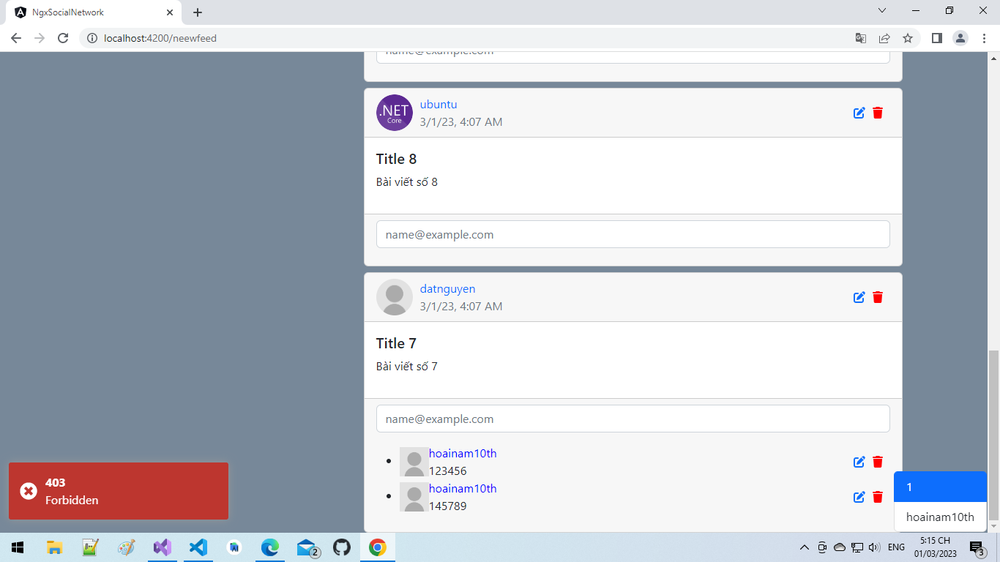
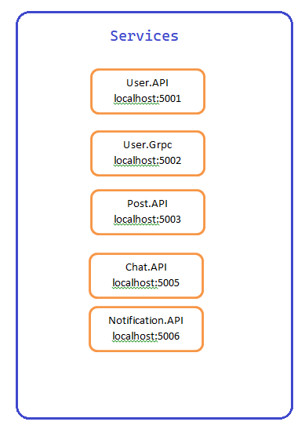

# SocialNetworkMicroservices

### Demo: https://youtu.be/kJbDd4T9JhM

# Cách chạy. Mở power shell (hoặc chuột phải vào file docker compose mở với power shell trong Visual Studio) chỉ tới đường dẫn file docker compose nhập lệnh sau:
```Docker
docker-compose -f .\docker-compose.yml -f docker-compose.override.yml up -d
```

# Muốn build lại toàn bộ server chạy trong docker nhập lệnh
```Docker
docker-compose -f .\docker-compose.yml -f docker-compose.override.yml up --build
```












